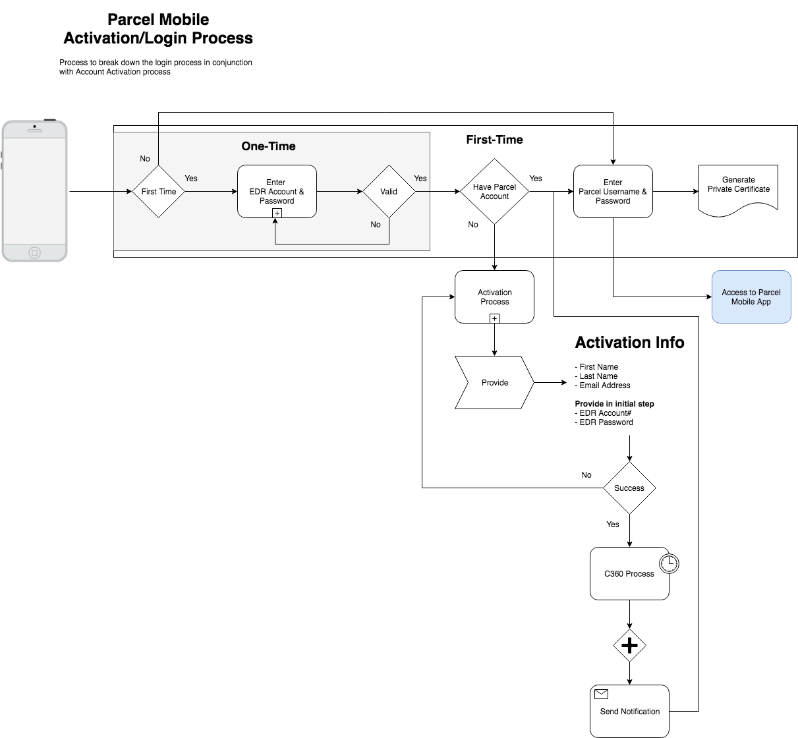

# Authentication

Access to the Parcel Mobile API system is limited to only registered
institutions and individuals, and the authentication process
for the LOS APIs is handled by an OAuth2 server. The full OAuth
2 framework is defined by the Internet Engineering Task Force
in RFC 6749:

    https://tools.ietf.org/html/rfc6749

## Authentication Process

<div style="text-align: center; border: 1px solid #ccc; padding: 20px; background: #fff;">
    
</div>

> The Parcel Mobile Authentication process, has an initial "First Time" process and a regular login process. The regular login process requires the user login with their Parcel Mobile account username and password.
> 
> The very first time a user opens and logins into the Parcel Mobile app, they will initially be challenged with the EDR Account Login. This is a one time, process to authenticate their EDR Account information, before logging into the Parcel Mobile app or signing up for a Parcel Mobile account.

#### Step 1: <span style="background-color: #ebb747; font-weight: bold; color: #ffffff; padding: 3px 10px; border-radius: 14px;">POST</span> (First Time only) Authenticate EDR Account

    /mobile/v1/auth/edr

The body of the request should consist of the following
JSON-encoded data (replacing `{edr-account}` and
`{password}` with the correct values for your
application):

```json
{
  "username": "{edr-account}",
  "password": "{password}" 
}
```

```
curl https://172.31.160.139:3030/mobile/v1/auth/edr \
  -H "Content-Type: application/json" \	
  -H "Accept: application/json" \	
  --request POST \	
  --data '{ \
      "username": "{edr-account}", \
      "password": "{password}" \
    }'
```

A successful response with produce the following response:

```json
{
    "response": {
        "code": 200,
        "timestamp": "2018-10-08T04:41:35.730Z",
        "type": "jwt"
    },
    "data": "eyJ0eXAiOiJKV1QiLCJhbGciOiJIUzI1NiJ9. . ."
}
```

The token must be used in the Regular Login authentication process. 

#### Step 2: <span style="background-color: #ebb747; font-weight: bold; color: #ffffff; padding: 3px 10px; border-radius: 14px;">POST</span> (Regular Login) Authenticate Parcel Mobile Account 

    /mobile/v1/auth/login

## Obtaining a Time-Limited Access Token

Every API request must contain an access
token, which is used to prove that the sender has successfully
authenticated itself as an application acting on behalf of a
registered user of the system.

For security reasons, access tokens are only valid for a
limited amount of time. If an API request is made with a
valid access token, but the API server responds with a 401
status code, then this indicates that the access token has expired. The
API client should obtain a new access token and repeat the
failed request.

Obtaining an access token is simple. Just send an HTTP `POST`
request to the following URL:

> Local Dev

    https://localhost:3030/mobile/v1/auth/login


> QA

    https://172.31.160.139:3030/mobile/v1/auth/login


> Production

    https://java.parcelmobile.com:3030/mobile/v1/auth/login
    

As always, be sure to include the following HTTP header:

    Content-Type: application/json
    Accept: application/json
    
The body of the request should consist of the following
JSON-encoded data (replacing `{username}` and
`{password}` with the correct values for your
application):

```json
{
  "username": "{username}",
  "password": "{password}",
  "jwt": "eyJhbGciOiJIUzI1NiIsInR5cCI6ImFjY2VzcyJ9. . ."
}
```

If you are using curl to test your API endpoints, the preceding
API request can be performed from the command line like so:

```
curl https://172.31.160.139:3030/mobile/v1/auth/login \
  -H "Content-Type: application/json" \	
  -H "Accept: application/json" \	
  --request POST \	
  --data '{ \
      "username": "{username}", \
      "password": "{password}", \
      "jwt": "eyJhbGciOiJIUzI1NiIsInR5cCI6ImFjY2VzcyJ9. . ." \
    }'
```

. . . If your request was successful, then you
should receive a response similar to the following:

```json
{
    "response": {
        "code": 200,
        "timestamp": "2018-10-08T04:41:35.730Z"
    },
    "data": {
        "accessToken": "eyJhbGciOiJIUzI1NiIsInR5cCI6ImFjY2VzcyJ9. . .",
        "user": {
            "aid": 45781,
            "firstName": "Swagatika",
            "lastName": "Rath",
            "username": "rrath",
            "email": "4613cb8b-a58@edrnet.com",
            "cid": 1218,
            "name": "EDR Applications Development Group",
            "fromMobile": 0,
            "edrAccount": "2013212",
            "_id": "Z21Xju7ouma6XkvZ"
        }
    }
}
```

## Performing an API Request

Once you have obtained an access token, you are ready to perform
your first API request. After identifying the API call you wish
to make, there are only two requirements for successfully
invoking the chosen API endpoint:

* A valid HTTP `Content-Type` header must be supplied,
  describing the format of the API request. Currently,
  only a value of `application/json` is supported.
  
* The access token must be supplied in an HTTP `Authorization`
  header with a case-sensitive value like the following:
  
  `Bearer EXAMPLE_ACCESS_TOKEN`
  
  There must be exactly one space between the word `Bearer` and
  the access token's value. Be careful to ensure that the "B" in
  "Bearer" is capitalized.
  
Note that the access token is supplied as a bearer token.
The usage of this type of token is defined in RFC 6750,
available at the following URL:

    https://tools.ietf.org/html/rfc6750

If the API request is successful, then you should receive an API
response data structure in the body of the HTTP response. The
API should return an HTTP status code of 200 (indicating
success).
